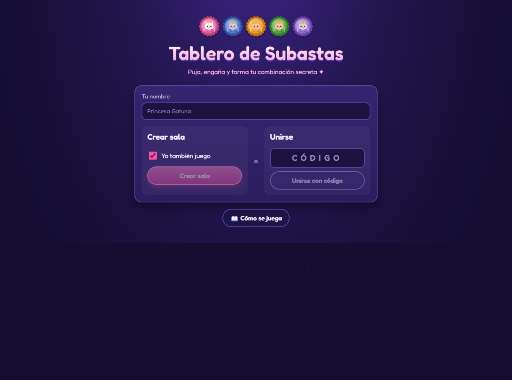
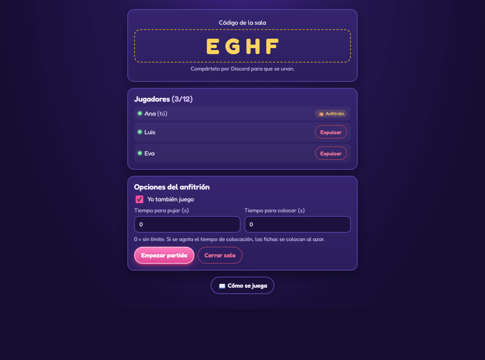
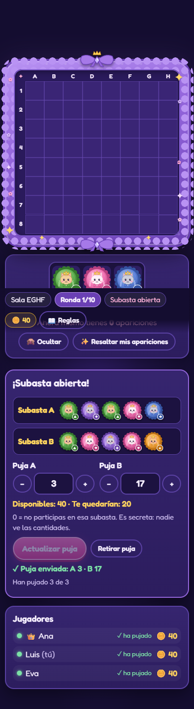
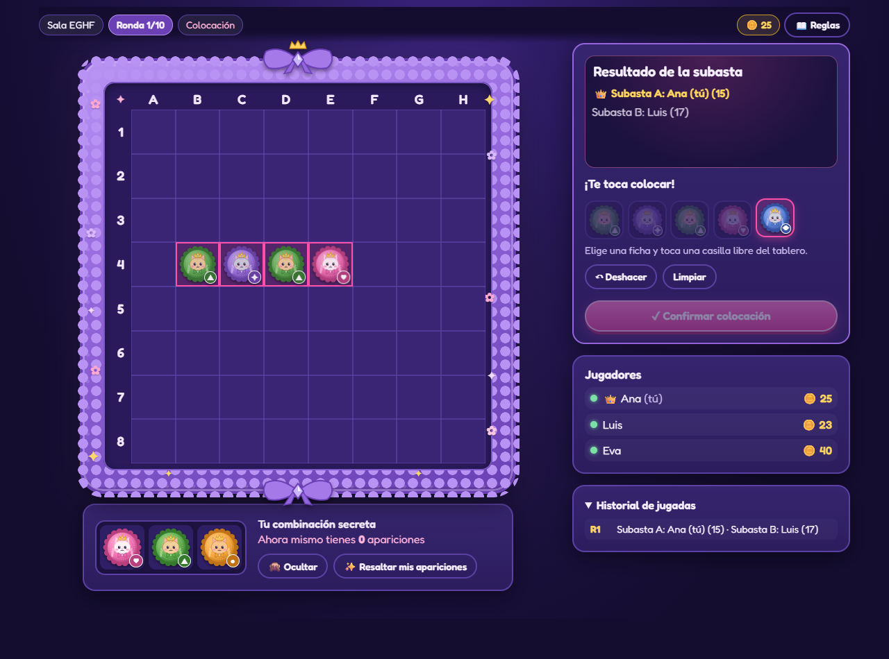
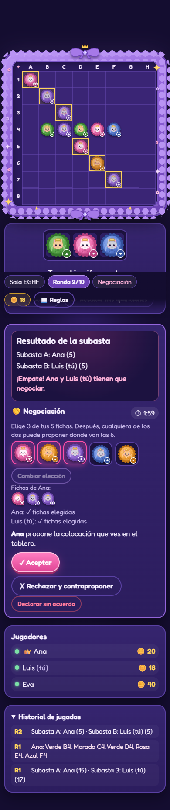
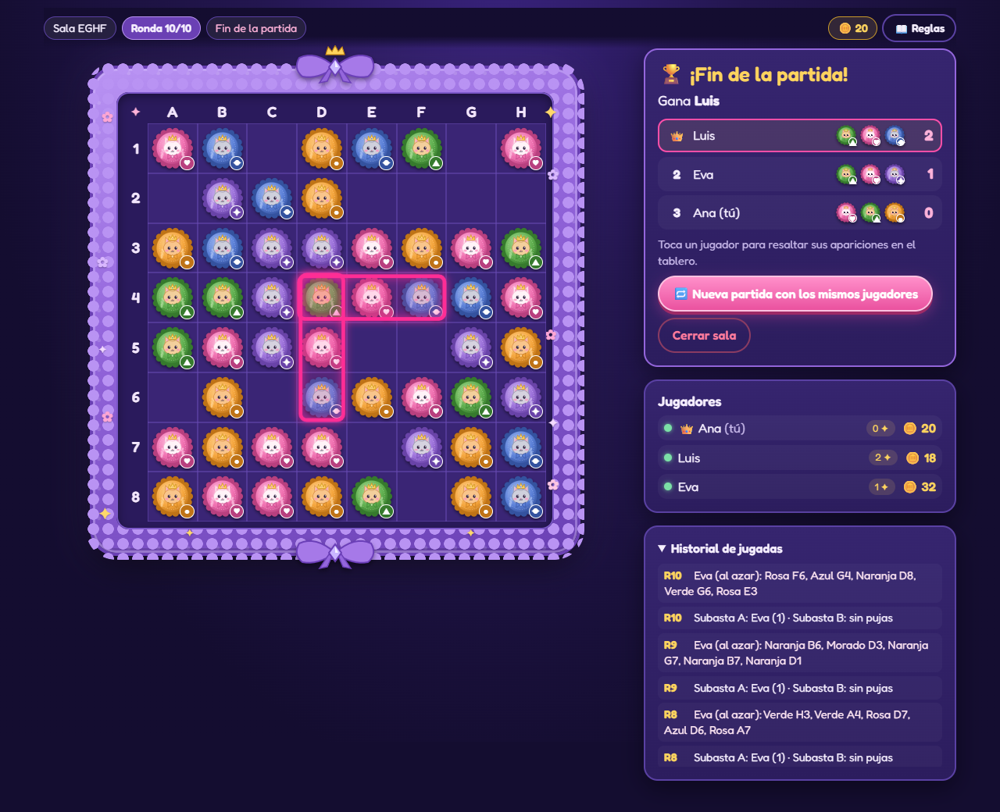

# 👑 Tablero de Subastas

Juego web multijugador en tiempo real que sustituye a los comandos del bot de Discord. Salas con código, subastas a ciegas, colocación por clic, negociación en caso de empate y recuento automático de apariciones. Toda la interfaz está en español y se puede jugar desde el móvil.

## Ejecutar en local

Requisitos: Node.js 18 o superior.

```bash
npm install
npm run dev        # servidor en :3001 + web en http://localhost:5173
```

Abre `http://localhost:5173` en varias pestañas (o en el móvil, con la IP de tu PC) para probar con varios jugadores.

Producción (un único proceso sirve la web y los sockets):

```bash
npm run build
npm start          # http://localhost:3001  (puerto configurable con PORT)
```

Tests (motor, máquina de estados e integración con 3 clientes Socket.IO):

```bash
npm test
```

## Desplegar

El estado vive **en memoria**, así que hay que usar **una sola instancia**. Si el servidor se reinicia, las partidas en curso se pierden.

### Render
1. Sube el repo a GitHub.
2. En Render: **New → Blueprint** y elige el repo (usa `render.yaml`). También vale **New → Web Service** con:
   - Build command: `npm ci --include=dev && npm run build`
   - Start command: `npm start`
   - Health check: `/health`
3. Render asigna `PORT` automáticamente. WebSockets funcionan sin configuración extra.

> En el plan gratuito el servicio "se duerme" sin tráfico: la primera carga tarda unos segundos y las salas abiertas se pierden al dormirse.

### Railway
**New Project → Deploy from GitHub repo**. Railway detecta el `Dockerfile`, o puedes usar Nixpacks con los mismos comandos de build y start de arriba.

### Docker
```bash
docker build -t tablero-subastas .
docker run -p 3001:3001 tablero-subastas
```

## Estructura

```
shared/     Motor del juego: funciones puras, sin red (lo usan servidor y cliente)
  config.ts   ← TODAS las constantes configurables (D1–D12)
  engine.ts   combinaciones, apariciones, pujas, resolución, colocación, resultados
  game.ts     máquina de estados de la partida (reductor puro)
  view.ts     vista filtrada que recibe cada jugador
  protocol.ts mensajes Socket.IO
server/     Express + Socket.IO, salas en memoria, temporizadores
client/     React + Vite
tests/      Vitest: motor, partida e integración
```

**Arquitectura.** El servidor es autoritativo: el cliente solo envía intenciones (`game:action`) y el servidor las pasa por `gameReducer`, que valida fase, jugador, puja, fichas y casillas. Después envía a **cada** jugador una vista construida con `buildView`, que nunca incluye combinaciones ajenas (hasta el final) ni pujas ajenas (solo las de los ganadores ya resueltos). El test de integración recorre todos los mensajes recibidos por cada cliente durante una partida entera y comprueba que no hay fugas.

**Reconexión.** Al crear o unirse a una sala, el servidor da un token que se guarda en `localStorage`. Si recargas la página o se corta la conexión, el cliente lo reenvía y recuperas tu sitio, tu combinación, tus monedas y tu puja pendiente.

### Flujo de la ronda

`LOBBY → FICHAS → PUJAS_ABIERTAS → RESOLUCION → [NEGOCIACION] → COLOCACION → RONDA_CERRADA → … → FIN`

| Fase | Quién actúa |
|---|---|
| FICHAS | El anfitrión pulsa *Repartir fichas* (se ven las 5+5) y luego *Abrir subasta*. |
| PUJAS_ABIERTAS | Todos pujan y pueden cambiar la puja. Se ve quién ha pujado, pero no cuánto. El anfitrión pulsa *Cerrar subasta* o salta el temporizador. |
| RESOLUCION | Es instantánea, salvo cuando un jugador gana A y B con la misma puja (D5): entonces elige con qué fichas se queda. |
| NEGOCIACION | Solo hay negociación si los dos ganadores empatan (ver abajo). |
| COLOCACION | El ganador toca una ficha y luego una casilla libre. Puede deshacer antes de confirmar. El anfitrión puede forzar una colocación aleatoria. |
| RONDA_CERRADA | El anfitrión pasa a la siguiente ronda (o a *Ver resultados* tras la 10). |

## Pantallas

| | |
|---|---|
| **Inicio**: nombre, *Crear sala* (con "Yo también juego") o *Unirse con código*.  | **Lobby**: código grande para copiar, lista de jugadores, expulsar, temporizadores opcionales y *Empezar partida*.  |
| **Pujas (móvil)**: fichas de A y B, campos con botones +/−, monedas restantes y quién ha pujado.  | **Colocación**: revelación de ganadores, bandeja de fichas y vista previa en el tablero.  |
| **Negociación (móvil)**: elegir 3 fichas, propuesta en el tablero (en dorado), aceptar, rechazar y contraproponer, o declarar sin acuerdo.  | **Final**: ranking con las combinaciones reveladas. Al tocar un jugador se resaltan sus apariciones.  |

Siempre visibles: tu combinación (con botón **Ocultar/Mostrar** por si compartes pantalla), **Resaltar mis apariciones** con un contador en vivo ("ahora mismo tienes 2" y, mientras colocas, cuántas tendrías con esa colocación), monedas, ronda n/10, jugadores con sus monedas e historial en notación `Rosa A3, Azul C7…` para quien siga la partida por voz. El botón **📖 Reglas** abre el resumen con el ejemplo de 15 contra 17.

**Accesibilidad.** Cada color lleva su símbolo (rosa ♥, azul ◆, naranja ●, verde ▲, morado ✦). Las casillas tienen etiqueta ("C4: Azul"), el foco se ve al navegar con teclado y las animaciones se desactivan con `prefers-reduced-motion`.

## Decisiones y supuestos (D1–D12)

Todo está en `shared/config.ts` para que lo puedas cambiar.

| # | Situación | Implementado |
|---|---|---|
| D1 | Colores | `COLORS`: rosa, azul, naranja, verde, morado. |
| D2 | Combinaciones | 3 colores distintos (`COMBO_LENGTH`), únicas y sin inversas entre jugadores. Caben hasta 30 jugadores (`MAX_DISTINCT_COMBOS`). |
| D3 | Puja válida | Entero ≥ `MIN_BID` (1) en cada subasta en la que participas (0 = no participas). A + B ≤ tus monedas. Con 0 monedas no se puede pujar. |
| D4 | Empate dentro de una subasta | **Cambiado a petición:** si empatan exactamente 2 y esa subasta es la que da fichas, cada una elige `SHARED_TIE_PICK` (2) de las 5 fichas, sin poder coger las que ya eligió la otra, y las coloca ella misma a la vez (sin propuestas ni aceptar). La quinta ficha se descarta y las dos pierden la puja. Si se acaba el tiempo, quien ya colocó conserva sus fichas y las del otro se descartan. Con 3 o más empatadas, o si las dos subastas acaban con la misma puja, desempate aleatorio anunciado a todos. Se puede volver a "siempre al azar" con `SAME_AUCTION_TIE_NEGOTIATES = false`. |
| D5 | El mismo jugador gana A y B | Recibe las fichas de la subasta donde pujó menos y pierde ambas pujas. Si pujó lo mismo en las dos, elige él (fase RESOLUCION). |
| D6 | Solo un ganador | Recibe sus fichas y pierde su puja. |
| D7 | Nadie puja | La ronda pasa sin efecto y las fichas se descartan. |
| D8 | Casillas | Solo casillas vacías; nunca se sustituyen fichas. |
| D9 | Negociación | Límite de `NEGOTIATION_TIME_LIMIT_S` = 120 s. Si expira o alguien declara "sin acuerdo", la ronda es nula y los dos pierden su puja. |
| D10 | Empate al final | Ganan todos los empatados. |
| D11 | Jugadores | `MIN_PLAYERS` = 2, `MAX_PLAYERS` = 12. |
| D12 | Revelación | Solo se muestran las pujas de los dos ganadores (y con quién empataron en D4). Las demás nunca salen del servidor. |

### Otros huecos que he cerrado (la opción más simple)

- **Coordenadas**: columnas A–H y filas 1–8, como en la imagen y en el PROMPT. Las reglas originales de Discord decían lo contrario (filas con letras). Lo he hecho así porque el PROMPT pide "como en la imagen".
- **Qué pierde un ganador**: solo la puja de la subasta que ganó. Si Ana gana A con 15 y también pujó 5 en B (que gana otra persona), recupera esos 5. Excepción: D5.
- **Monedas durante la subasta**: no se descuentan al pujar, solo se reservan. Se cobran al cerrar la subasta.
- **Fichas de cada subasta**: 5 colores al azar con repetición (puede salir 3 veces rosa).
- **Temporizadores** (`DEFAULT_AUCTION_TIMER_S`, `DEFAULT_PLACEMENT_TIMER_S`, 0 = sin límite; el anfitrión los cambia en el lobby, hasta `MAX_TIMER_S`):
  - Si se agota el de pujas, la subasta se cierra sola.
  - Si se agota el de colocación, las fichas se colocan al azar.
  - Sin límite, el anfitrión puede forzar la colocación aleatoria cuando quiera (pide confirmación).
- **Negociación**:
  - Cada uno puede cambiar sus 3 fichas, pero hacerlo anula la propuesta que hubiera.
  - Cuando los dos han elegido, cualquiera puede proponer. Una propuesta nueva sustituye a la anterior y solo la otra persona puede aceptarla.
  - Los demás jugadores ven quién negocia, si ya han elegido fichas y si hay una propuesta, pero no qué fichas eligieron ni dónde van. La colocación se hace pública al aceptarse.
- **Entrar y salir**:
  - Solo se puede entrar en la sala desde el lobby (no hay espectadores) y los nombres no se pueden repetir dentro de una sala.
  - Solo se expulsa desde el lobby.
  - Quien se desconecta en mitad de la partida conserva su sitio. Si le tocaba colocar, el anfitrión puede forzar la colocación aleatoria.
  - El anfitrión no sale de la sala: la cierra.
- **"Nueva partida con los mismos jugadores"**: empieza ya una partida nueva (tablero vacío, 40 monedas, combinaciones nuevas) con quienes estaban jugando.
- **Salas abandonadas**: se borran tras 30 minutos sin nadie conectado (`EMPTY_ROOM_TTL_MS`).
- **Código de sala**: 4 letras sin I ni O para evitar confusiones (`ROOM_CODE_LENGTH`, `ROOM_CODE_ALPHABET`).

### Herramientas del anfitrión (añadidas después)

- **Ver pujas de todos**: con la subasta abierta, el anfitrión puede ver las pujas actuales. Cada vez que mira, queda en el historial ("👀 Ana ha mirado las pujas") y a los demás les sale un aviso. Las pujas solo llegan al anfitrión que las pide, nunca en la vista del resto.
- **Enviar sin pujar**: enviar 0 y 0 cuenta como "enviado" (✓ en la lista de jugadores) sin participar en ninguna subasta. Se puede cambiar mientras la subasta siga abierta. Sustituye al antiguo botón "Retirar puja".
- **Añadir o quitar monedas**: botón **±** junto a cada jugador (0 a `MAX_COINS`). Queda en el historial y se avisa a todos. Con la subasta abierta no se puede dejar a nadie con menos monedas de las que ya ha pujado.
- **Terminar partida ahora** y **Cerrar sala**: en "⚙️ Controles del anfitrión" durante la partida. Terminar cuenta las apariciones con el tablero tal y como está.
